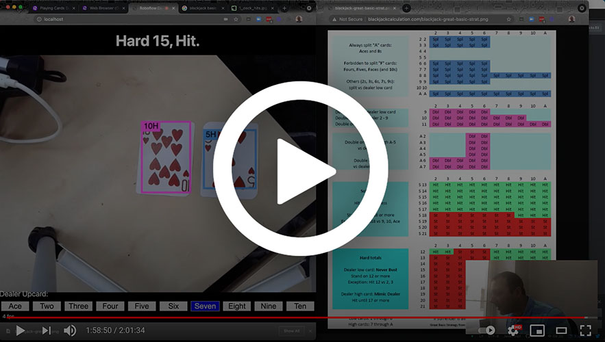

# Blackjack Basic Strategy
A computer vision powered Blackjack basic strategy web-app powered by
[Roboflow](https://roboflow.com).

It runs a
[playing cards object detection model](https://universe.roboflow.com/augmented-startups/playing-cards-ow27d)
in your web browser with
[roboflow.js](https://docs.roboflow.com/inference/web-browser)
(which is backed by
[tensorflow.js](https://www.tensorflow.org/js)). Simply point your camera at a
Blackjack hand, tell it what card the dealer has facing up, and it will tell you
what your optimal next move is based on
[basic strategy](http://www.blackjackcalculation.com/blackjack-great-basic-strat.png).

## [🤳 Try it on your phone or in your web browser on GitHub Pages here.](https://roboflow.github.io/blackjack-basic-strategy/)

### Watch the Live Stream
This app was live coded on YouTube; [watch the recording](https://www.youtube.com/watch?v=xzh_R8u0hNc).

### Resources

* [Try It](https://roboflow.github.io/blackjack-basic-strategy/) - this project is deployed on GitHub Pages. You can try it on your phone or computer's webcam. Just point your camera at a Blackjack hand, select the dealer's face-up card, and it will tell you what to do.
* [Roboflow Universe](https://universe.roboflow.com) - share computer vision datasets and pre-trained models.
* [Playing Cards Pre-Trained Model](https://universe.roboflow.com/augmented-startups/playing-cards-ow27d) - shared on Roboflow Universe by [Augmented Startups](https://www.augmentedstartups.com/).
* [Roboflow YouTube](https://www.youtube.com/channel/UCUlRrGpNRT5jbiV8h5Q_4Fg?sub_confirmation=1) - where you can follow along with the live-coding session of this app being built and find other computer vision content.
* [Roboflow](https://roboflow.com) - everything you need to create your own custom computer vision projects for free (if you're sharing them publicly). Upload, annotate, augment, train, and deploy in a single afternoon (then iterate and improve your model over time).
